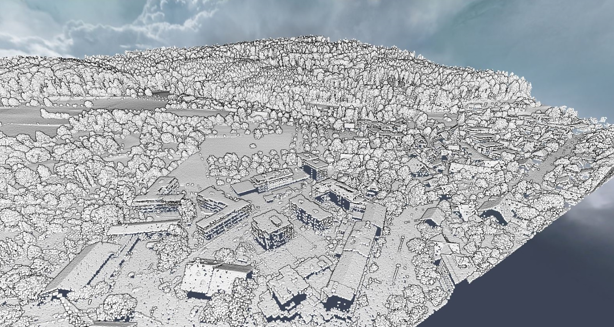
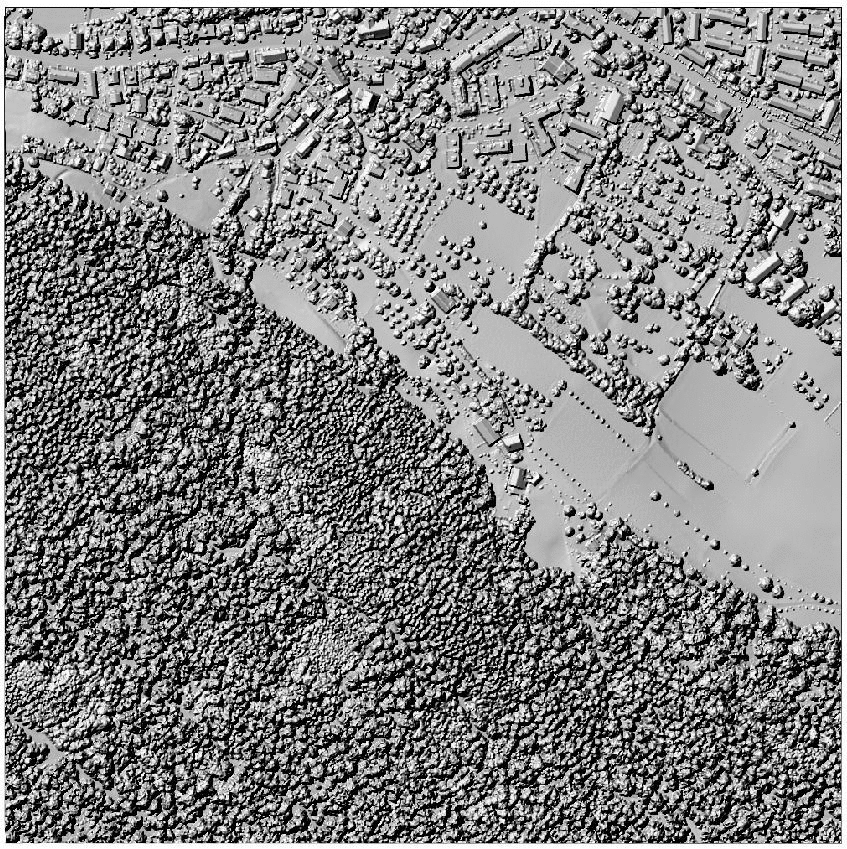

# LiDAR-Processing
Reads and analyzes all .las files in a given folder, removing outliers, duplicates and interpolating point cloud files into a single raster (DEM). The final part post-processes the generated DEM by filling depressions and no data values and generates geomorphometric raster's such as slope, curvature, and hillshade.

